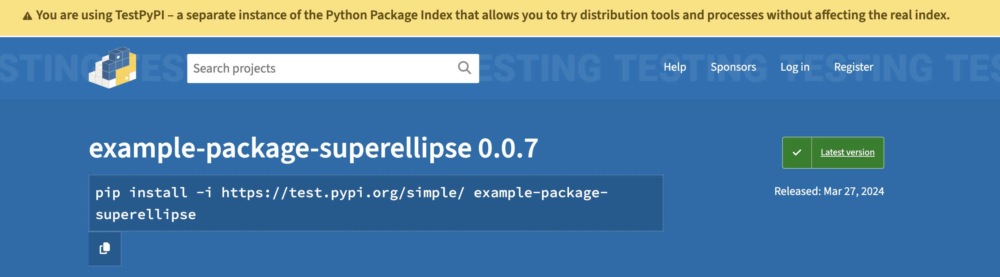
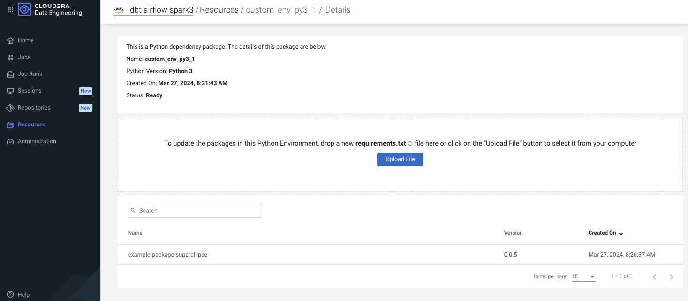
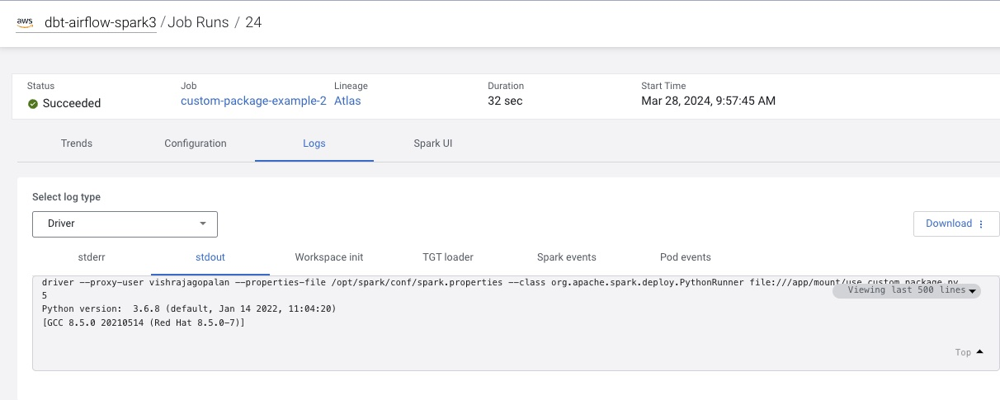

Creating and accessing Custom Python Package from Internal PyPi mirror in Cloudera Data Engineering
===
## Introduction :

Data Engineers frequently use templated code snippets for e.g. connecting to data sources across workloads. These code snippets evolve into libraries and developers create custom packages and save them an organization approved pypi mirror internally, since the code often uses sensitive organization specific assets such as authentication mechanisms and datasets.  

Cloudera Data Engineering ( CDE) provides a flexibility in managing such custom packages. To understand multiple ways to attach custom packages, refer to the Blog in the references section. In this tutorial, we will explore how we can use a CDE to create and access such a package. 

## Setup Prerequisites :
- CDE Version  > 1.20
- CDE CLI configured and connecting to an existing CDE VC Cluster
- TestPyPi Account ( Create one from [here](https://test.pypi.org/account/register/))
- Familiarity with running CDE CLI commands from terminal session (see References section if you are unfamiliar with this)


## Tutorial: 
* As a first step , we need to understand how to package a Python projects. Follow the step by step tutorial from Python Packaging Guide link in References section.  It will show you how to add the necessary files and structure to create the package, how to build the package, and how to upload it to the Python Package Index (PyPI). A shortcut to the tutorial is provided [Here](https://packaging.python.org/en/latest/tutorials/packaging-projects/).

* If you completed the above step you should be able to see the deployed packages in the https://test.pypi.org. Your specific package name and version numbers may be different 


  
  
* Next open requirements.txt and change replace the package name `example-package-superellipse` with the package name you have created. 

* Next launch Terminal from the computer / host that is configured to connect to CDE. and run the following steps to create and run the CDE Job. 
  

### CDE CLI Commands :

  
```

# NOTE: 
#  1. Replace the VC Cluster name dbt-airflow-spark3 with the name of your own VC Cluster
#  2. Execute the CLI Step after each comment line and wait until you get the result

# Step1 : Create a Python Environment with custom Pypi URL. Replace test.pypi with 
#         your internal Pypi mirror where your package is stored
cde resource create --name custom_env_py3  --type python-env  --pip-repository-url "https://test.pypi.org/simple/"   --config-profile dbt-airflow-spark3

# Step2 : Upload the requiremments.txt
cde resource upload --name custom_env_py3 \
            --local-path ../requirements.txt --config-profile dbt-airflow-spark3

#Step 3: check status of the resource creation
cde resource list-events --name "custom_env_py3_2" --config-profile dbt-airflow-spark3

# Step 4: Create a file resource for storing your python file
cde resource create --name my_pipeline_resource --config-profile dbt-airflow-spark3   

#Step 5 : Upload the python file
cde resource upload --name my_pipeline_resource --local-path use_custom_package.py  --config-profile dbt-airflow-spark3 

#Step 6: Create a Job
cde job create --type spark \
 --mount-1-resource my_pipeline_resource \
--application-file use_custom_package.py \
--python-env-resource-name custom_env_py3 \
--name custom-package-example \
--config-profile dbt-airflow-spark3

#Step 7: Run the Job
cde job run --name custom-package-example-2 --config-profile dbt-airflow-spark3 
```
## Result Validation:
If all the steps in CDE CLI above have been executed succesfully, you can launch CDP, navigate to  CDE UI and observe the following :

* A CDE Python environment resource with your custom package ( Outcome of Step 3 above)
  

  
* A Job executed succesfully with the value of your custom python package function output. 
  


  

## References and Further Reading
1. [Packaging Python Projects](https://packaging.python.org/en/latest/tutorials/packaging-projects/)
2. [CDE CLI Documentation](https://docs.cloudera.com/data-engineering/cloud/cli-access/topics/cde-cli.html)
2. [Managing Python Dependencies](https://blog.cloudera.com/managing-python-dependencies-for-spark-workloads-in-cloudera-data-engineering/)